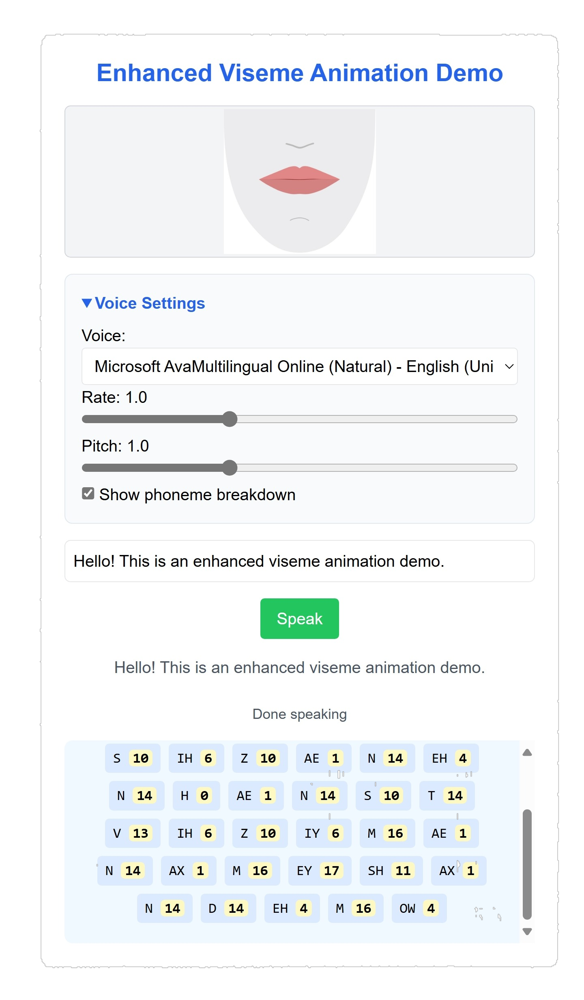

# LipSync

LipSync is a web-based demo for speech synthesis-driven lip synchronization. It uses JavaScript to map phonemes to viseme images, creating an animated, real-time visual representation of spoken text. The project features adjustable voice settings and a phoneme breakdown display.

## Demo Screenshot

## Features

- **Real-time Lip Sync**: Maps phonemes to viseme images dynamically.
- **Voice Settings**: Adjustable rate and pitch for speech synthesis.
- **Phoneme Breakdown**: Visualizes the phoneme-to-viseme mapping.
- **Customizable**: Easily extendable for additional viseme images or voices.

## How to Use

1. Open the `VisemeLocalImagesEnhanced.html` file in a browser.
2. Select a voice and adjust the rate and pitch as needed.
3. Enter text in the input box and click "Speak" to see the animation.

## File Structure

- **animationController.js**: Handles the animation logic.
- **config.js**: Stores configuration settings.
- **domElements.js**: Manages DOM interactions.
- **main.js**: Entry point for initializing the application.
- **phonemeProcessor.js**: Processes phoneme data.
- **speechManager.js**: Manages speech synthesis.
- **viseme.js**: Defines viseme mappings.
- **visemeManager.js**: Coordinates viseme display.
- **viseme-images/**: Contains viseme image assets.

## Requirements

- A modern web browser with JavaScript enabled.

- It works best with the Edge browser currently, as it is optimized for compatibility and performance with this browser.
